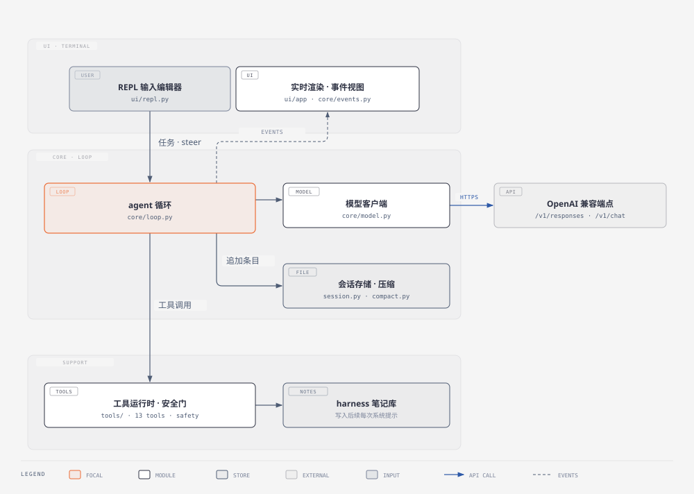

# Wheel Agent

> 因为是重复造 Agent 轮子，所以就叫 Wheel Agent。

一个体量小但功能完整的 Python coding agent。一个本地 agent loop，接任意 OpenAI 兼容端点（Responses 或 Chat Completions），配上一套崩溃安全的分叉会话文件、保持前缀缓存的历史压缩、文件级 undo、持续学习 harness，还有可回放的运行记录。

目标是可读性：全部代码约 11k 行，运行时依赖只有两个包（`openai`、`python-dotenv`），没有框架，没有 MCP，没有 RPC。一个循环、一个 JSONL 会话文件、一个终端。coding agent 的完整链路（循环、流式、缓存、压缩、安全、undo、回放）在文中有独立小节，可对照文末模块地图逐块读。


## 运行

环境：推荐 Python 3.12（3.10+ 可用，代码用了 `X | Y` 类型标注）；依赖只有两个包，`openai` 和 `python-dotenv`。

仓库根目录就是 Python 包。包名是 `wheel_agent`（Python 标识符不能带连字符，目录叫 `wheel-agent` 时补一个符号链接即可）：

```bash
cd ~/src                              # 假设仓库在 ~/src/wheel-agent
python3.12 -m venv .venv && . .venv/bin/activate
pip install openai python-dotenv
ln -s wheel-agent wheel_agent         # 让包以 wheel_agent 的名字可导入
export PYTHONPATH="$PWD"

alias wheel='python -m wheel_agent.ui.app'   # 启动命令，建议写进 ~/.zshrc / ~/.bashrc
wheel                     # 交互 REPL，工作区 = 当前目录
wheel "修这个 bug"          # 一次性任务
wheel --json "任务"         # stdout 输出一行 JSON
```

配置放在工作区的 `.env`（或写进环境变量）。模板在仓库根目录：`cp .env.example .env` 再填值。最小一段：

```bash
OPENAI_API_KEY=sk-...
OPENAI_BASE_URL=https://api.openai.com/v1   # 或任何兼容端点
OPENAI_MODEL=gpt-4.1-mini
DEFAULT_PROVIDER=openai
```

`--json` 模式输出一行 JSON，流式帧不进 stdout：

```json
{"text": "...", "stop_reason": "stop", "run_id": "...", "task_id": "...",
 "session_id": "...", "usage": {...}, "changed_files": ["ui/repl.py"]}
```

退出码：0 表示正常结束（stop / max_turns / plan_rejected），1 表示异常，2 表示配置错误（比如缺 key）。

## REPL 里的前五分钟

```
> 在这个目录写个 hello.py 然后跑一下
> /tree            # 会话树；/tree <id> 跳到某个节点继续，就是分叉
> /refine          # 从这段对话提取可复用的经验，写入 harness
> /undo            # 撤销最近一次 write/edit，不依赖 git
> /jobs            # 查看后台 bash 作业
> /effort high     # 调推理档位
> /quit
```

任务运行中：**回车输入文字 = steer**（并入下一次模型调用）；`/follow 文本` = 任务结束后作为新回合投递；`Ctrl+C` 或 `/stop` = 中止，已完成的回合保留在会话里。

### 全部斜杠命令

| 命令 | 作用 |
|---|---|
| `/help` | 本表（`/` 同义） |
| `/quit` `/exit` `/q` | 退出（Ctrl+C / Ctrl+D 也行） |
| `/provider [name]` | 切换模型通道（无参数时 ↑↓ 选择） |
| `/effort [level]` `/think` | 推理档位（↑↓ 选择） |
| `/compact` | 立即压缩会话历史 |
| `/undo [n]` | 撤销最近 n 次 write/edit |
| `/undo-task` | 回滚最近一个任务的全部文件改动 |
| `/new` | 新开会话 |
| `/sessions` | 列出本项目会话 |
| `/resume [id]` | 恢复会话（↑↓ 带预览） |
| `/tree [id]` `/fork` | 会话树；跳转即分叉 |
| `/plan` | 打印当前计划 |
| `/harness` | 查看 harness（进入后续 system prompt 的笔记） |
| `/refine [text\|rollback <id>]` | 从轨迹提取经验（带 CAS 校验）；回滚某次提取 |
| `/refine auto [N\|off]` | 每 N 个用户回合后台自动提取（默认 8） |
| `/jobs` `/jobs kill [id]` | 后台 bash 作业管理 |
| `/graph` `/graph html` | 当前路径的 turn/工具 DAG，文本或网页 |
| `/replay [run_id] [go]` | 浏览 / 重放录制的运行 |
| `/replay session [dir]` | 按顺序重放整个会话 |
| `/follow <text>` | 停机后投递的排队文本 |
| `/stop` | 中止当前任务 |
| `/expand r12` | 展开被裁剪的工具输出 |
| `/max-turns [n]` | 查看或设置回合上限（0 = 不限） |

命令必须以 `/` 开头；非 `/` 开头的输入按任务发给模型。输入 `/` 后 Tab 从这张表补全。

### 输入编辑器

- 完整行编辑（方向键、Home/End、Ctrl+A/E/W/K、词跳转），多行视觉折行，历史记录。
- **括号粘贴**：多行粘贴作为一次输入到达，菜单在粘贴期间保持安静。
- **斜杠菜单**：输入 `/` 列出匹配命令，↑↓ 回车选中，Esc 关闭。
- **@ 文件补全**：`@` 列出工作区文件；任务里的 `@src/main.py` 会展开成文件内容喂给模型。
- **Shift+Enter** 换行（与 Enter 有 20ms 的区分窗口；把两者都发成 `\r` 的终端照常工作，只是无法用 Shift+Enter）。
- 任务运行时提示符固定在实时页脚上方，输入的文字不会破坏流式帧（页脚用 DECSTBM/DECSC 独占自己的屏幕行，回滚区保持干净）。

## Provider 与配置

可配置任意数量的 provider，运行时用 `/provider` 切换；每个 provider 目前对应一个模型（`<前缀>_MODEL`），没有 provider 内的多模型列表。每个 provider 一组前缀变量：

| 变量 | 含义 |
|---|---|
| `<前缀>_API_KEY` | 必填（没有 key 的块被忽略） |
| `<前缀>_BASE_URL` | 默认 `https://api.openai.com/v1` |
| `<前缀>_MODEL` | 模型名 |
| `<前缀>_API` | `responses`（默认）或 `chat`；base URL 写到 `/chat/completions` 结尾也会切到 chat |
| `<前缀>_REASONING_LEVELS` | 显式档位列表，如 `off,low,medium,high`（缺省按模型名推断） |
| `<前缀>_REASONING_EFFORT` | 该 provider 的档位覆盖 |
| `<前缀>_CONTEXT_WINDOW` | auto-compact 用的 token 预算（缺省按模型名查表） |
| `<前缀>_INPUT_PRICE` 等 | 每 1M token 价格，喂给成本表 |

全局变量：`DEFAULT_PROVIDER`、`REASONING_EFFORT`（按模型钳制，非推理模型完全不发这个字段）、`WHEEL_TIMEOUT`（单次 API 调用秒数，默认 180）、`WHEEL_API_RETRIES` / `WHEEL_API_RETRY_BASE`（重试）、`WHEEL_AUTO_REFINE`（自动提取频率，`off` 关闭）、`WHEEL_RUNS_DIR`（运行记录目录，默认 `.wheel_runs`）、`WHEEL_COLOR=0` / `NO_COLOR=1`（关颜色）、`EXA_API_KEY` / `TAVILY_API_KEY`（联网搜索的 key，可选）。

项目上下文文件按 `AGENTS.override.md`、`AGENTS.md`、`CLAUDE.md` 的顺序从工作区向上搜索到 git 根，进入 system prompt。技能从 `.wheel/skills`、`.agents/skills`、`skills/`、`~/.wheel/skills`、`~/.agents/skills` 加载；项目级技能首次使用要确认信任（记在 `.wheel/trust.json`）；`/skill:名字` 注入技能全文。

## 架构



其余配套图表见 [docs/diagrams](docs/diagrams)：agent 循环时序、会话生命周期状态机、压缩判定流程。

### 循环（core/loop.py）

整个 agent 就是一个 while 循环：

```
system prompt（基础 + 上下文文件 + harness + plan）
用户回合
  → 模型调用（流式）
  → 执行模型要的工具，结果追加回去
  → 直到模型停下 / 触到上限 / 被中止
```

这是 **ReAct 范式**（Reason + Act）：同一个上下文里，模型每轮交替“推理 → 调工具 → 看结果”，工具输出直接成为下一轮的观察，模型据此自己决定下一步。它没有 Plan-and-Execute 那种“先出完整计划、再由独立执行器逐步跑”的分工；`/plan` 只是同上下文里的一个工具——模型写步骤、用户批准，之后每个步骤仍由主循环执行并更新进度，计划只是上下文里的状态，没有单独的规划阶段。

让它能干活的是把记账做对：

- **回合**是计量单位：一次模型调用加它的工具结果算一回合；`/max-turns` 按回合数。
- **事件**（core/events.py）是一条扁平流，一次 `emit` 同时喂 TTY 渲染器、JSONL 记录器、审计日志。UI 只是事件流的一个视图，不在循环里。
- **steering 是队列**（core/queue.py）：循环在两次模型调用之间检查队列；Ctrl+C 在流式中也保持响应就是这个原因。
- **plan 模式**：模型想执行的步骤要对照批准过的计划，不匹配就 `plan_rejected`，多步工作不靠额外模型调用保持诚实。

### 会话是一个文件（core/session.py）

会话是工作区 `.wheel/` 下的**追加式 JSONL 树**：

```jsonl
{"type":"session","id":"s4f8...","created":1724000000}
{"type":"item","id":"i001","parent":null,"item":{"role":"user","content":"fix ..."}}
{"type":"item","id":"i002","parent":"i001","item":{"role":"assistant", ...}}
{"type":"item","id":"i003","parent":"i002","item":{"role":"tool", ...}}
```

- 没有 WAL、数据库或锁文件，文件即日志。每次追加或重写后都 flush + fsync（强制操作系统把缓冲区写入磁盘），掉电不会丢已确认的记录，代价是每次工具调用多一次磁盘同步。每行是一条完整 JSON，**崩溃最多留一行没写完的尾行**，读取端直接跳过。
- 每条记录带 `parent_id`，整个会话是一棵树，“当前对话”是从根到叶的一条路径。跳到旧节点继续输入 = 把“叶子”指针移回那个节点，新分支与旧前缀共享同一批记录，**分叉零拷贝**。因此 `/tree`、`/resume`、`/fork` 都只是树的遍历。
- **恢复修复**：崩溃丢掉了工具调用的输出时，加载器补一条合成的 interrupted 输出，保证消息序列对 API 合法。
- 压缩会重写文件（覆盖语义），但保留 `_saved` 水位，重写后的追加不会重复落盘。

### 前缀缓存策略（core/compact.py）

provider 对缓存写入计费、对缓存命中给低延迟，会话中途把前缀缓存打失效又费钱又费时间。规则：

1. **已发送的历史绝不改写。** 压缩在用户消息边界切一刀：切点之前的前缀换成一条摘要，切点之后的条目逐字节不动，缓存已持有的部分继续有效。
2. **切点只向前走，缓存键只在压缩时更换。** 请求里带一个 `prompt_cache_key`（会话的 `cache_epoch`）作为 provider 的缓存分区标识。普通回合只是追加新消息：前缀没变、键没变，缓存持续命中。压缩一旦改写了前缀，旧缓存必然失效，于是键递增、provider 从新键开始重新积累缓存，旧分区不会被错误复用。
3. **auto-compact 看真实用量触发**，不看 token 估算：provider 报告的输入 token 逼近上下文窗口时触发（页脚计量表显示同一个数）。
4. **摘要带状态标签**（`<read-files>`、`<modified-files>`），压缩后的模型知道前缀碰过哪些文件。摘要由同通道的一次模型调用（同 provider、同推理档）生成，天然有损。
5. 对极小会话压缩是无操作：原样返回，epoch 不动。

### 安全、审批、undo（tools/safety.py、core/checkpoint.py）

- **敏感路径拒写**：`.env`、`.git`、`.ssh`、凭据等；指向它们的符号链接也拒（先解析路径，再逐组件复查）。
- **bash 审批按意图记**，不按字符串：命令解析成意图（什么动作、对哪些路径），同一意图一个会话只确认一次；`rm -rf` 级别的意图永远要确认。
- **不用 git 的 undo**：每次 write/edit 先快照旧内容。`/undo [n]` 恢复最近 n 份快照；`/undo-task` 回滚上个任务的全部改动，含新建的文件（删除）和重写的文件。二进制和超过 1MB 的文件按嗅探跳过，存储保持小。

### 持续学习（harness/）

模型通过 `harness` 工具把**耐久笔记**存进全局库（`~/.wheel/harness/`）或会话库，后续每次 system prompt 都带上。这是“跨会话变好”的回路：

- `/refine` 追加一次模型调用（与会话同 provider 同模型，关闭推理档）复盘这段对话：提炼出值得跨会话记住的经验，产出对 harness 的结构化修改提案。
- 每份提案带 **CAS 基线**（compare-and-swap）：提案规划前先对目标 harness 全量拍一份快照；应用时逐条比对，某个条目与快照不一致（说明规划期间被手动编辑、或另一次 refine 改过），这条编辑标记失败并跳过，不覆盖新状态。
- `/refine rollback <id>` 回滚某次提取。自动提取在后台线程每 N 个用户回合跑一次，输出排队成普通事件，不和你正在输入的内容交错。
- harness 状态文件损坏时降级为空状态，应用不崩。

### 工具层（tools/tools.py）

13 个工具，刻意小而无聊，每个都是一次文件操作加校验：

| 工具 | 行为 |
|---|---|
| `read` | 带偏移/上限读文件；长输出溢写到 `.wheel/outputs/` 留指针 |
| `write` | 新建/覆盖（先快照供 undo；过敏感路径检查） |
| `edit` | 精确替换 old→new；必须恰好匹配一次，歧义报错（或 `replace_all`） |
| `ls` / `glob` | 列目录 / 模式匹配 |
| `grep` | 正则搜索，PATH 上有 ripgrep 就用（更快，尊重 .gitignore） |
| `bash` | 执行命令（前台默认 120 秒超时）；`background=true` 返回 job_id |
| `bash_poll` / `bash_kill` | 读后台作业输出 / 杀作业（`/jobs` 管理） |
| `skill` | 把技能全文载入上下文 |
| `harness` | 读写笔记库 |
| `plan` | 计划步骤的增改完成（驱动 `plan_rejected`） |
| `web_fetch` / `web_search` | 抓网页转文本（SSRF 防护、不跟随重定向）/ Exa 搜索，Tavily 兜底 |

长工具输出按稳定的前后缀裁剪，全文写盘（core/truncate.py）；`/expand <run>` 重新打印。

### 实时 UI（ui/）

- 模型文本边到边渲染（say 帧流式，think 帧更暗）。
- 工具调用渲染成紧凑行，输出裁剪到几行，带 `/expand` 指针。
- **页脚计量表**（上下文用量、成本、回合、模型）用 DECSTBM（滚动区域）加 DECSC/DECRC（光标保存）独占屏幕行，流式不会弄坏它，resize（SIGWINCH）重排不撕裂。尺寸来自 ioctl，不信过期的 COLUMNS 环境变量。
- 同一套事件打印机也服务 `/replay`：回放就是同一个 UI 喂录制的事件流。

### 回放（ui/replay.py）

作用是**离线复现与可复现性审计**。每次运行记录 `events.jsonl`（发生了什么）和 `responses.jsonl`（模型原始响应）。`/replay <run_id> go` 把当时的任务在干净的工作区副本上重跑一遍，但**用录好的响应替换模型**——不调 API、不花钱、结果可复现——然后把重放结果与原记录对比，给出复现程度分类：

| 类别 | 含义 |
|---|---|
| `exact` | 工具决策、停止原因、工作区指纹全部一致 |
| `behavioral` | 行为一致（时序或非确定性差异） |
| `drift` | 分歧但完成 |
| `error` | 回放本身出错 |

这是评测数字背后的确定性审计：解决率 100% 而回放 exact 率 0%，说明基准量到的是模型随机性；exact 稳定在高位，才说明 harness 本身的行为可复现。

## 模块地图

```
wheel_agent/
  core/            agent 核心
    loop.py          agent 循环
    model.py         Responses + Chat Completions 客户端（流式、重试、取消）
    reasoning.py     档位刻度、钳制、按 API 组装
    prompt.py        system prompt 组装
    context.py       token 估算、上下文文件、技能展开
    session.py       JSONL 树存储
    compact.py       对缓存友好的压缩
    checkpoint.py    文件快照 → /undo /undo-task
    truncate.py      输出裁剪 + 溢写盘
    plan.py          计划步骤 + 拒绝
    events.py        事件流 + JSONL 记录
    queue.py         steer/follow/abort 队列
    meter.py         回合/token/成本表
    config.py        .env → AgentConfig
    types.py         共享 dataclass
  tools/           工具层
    tools.py         13 个工具 + 后台作业
    safety.py        敏感路径 + bash 意图审批
    trust.py         项目技能信任
    audit.py         运行审计（哈希、指纹、权限裁决）
    workspace.py     工作区指纹
    rgfiles.py       glob/grep（有 ripgrep 就用）
    atfiles.py       @文件引用展开
    web.py           SSRF 防护的抓取/搜索
  ui/              终端 UI
    repl.py          REPL（输入编辑器、忙时提示、分发）
    style.py         TTY 样式、ansi、终端尺寸
    markdown.py      终端 markdown 渲染
    graph.py         会话 DAG → ascii/HTML
    replay.py        录制响应回放
    app/             TUI 进程
      state.py         AppState（页脚/实时/活动/后台提取状态）
      live.py          LiveTurn、工具片段、事件打印、计量
      commands.py      /resume /tree /graph 等命令实现
      refine.py        手动 + 自动 refine（一个执行核，两种呈现）
      __init__.py      进程管线：配置加载、run_task、--json、会话 CLI、分发
  harness/         持续学习
    harness.py       笔记库（CAS、回滚、容错加载）
    refine.py        经验提取（关推理档的复盘调用）
```

## 逐段讲解（docs/modules/）

上面每个源文件都有一篇逐段讲解（含行号、设计意图、边界与陷阱）。入口是 [阅读指南](docs/modules/README.md)：5 个阶段的阅读路线、一条请求的完整生命周期（从敲回车到 replay 的 18 步串讲）、核心概念索引。

- [core/loop.py 主循环（19 节）](docs/loop-explained.md)
- core/：[types](docs/modules/core/types.md) · [config](docs/modules/core/config.md) · [model](docs/modules/core/model.md) · [context](docs/modules/core/context.md) · [truncate](docs/modules/core/truncate.md) · [compact](docs/modules/core/compact.md) · [session](docs/modules/core/session.md) · [events](docs/modules/core/events.md) · [queue](docs/modules/core/queue.md) · [plan](docs/modules/core/plan.md) · [prompt](docs/modules/core/prompt.md) · [reasoning](docs/modules/core/reasoning.md) · [checkpoint](docs/modules/core/checkpoint.md) · [meter](docs/modules/core/meter.md)
- tools/：[tools](docs/modules/tools/tools.md) · [safety](docs/modules/tools/safety.md) · [workspace](docs/modules/tools/workspace.md) · [audit](docs/modules/tools/audit.md) · [trust](docs/modules/tools/trust.md) · [rgfiles](docs/modules/tools/rgfiles.md) · [web](docs/modules/tools/web.md) · [atfiles](docs/modules/tools/atfiles.md)
- harness/：[harness](docs/modules/harness/harness.md) · [refine](docs/modules/harness/refine.md)
- ui/：[app](docs/modules/ui/app.md) · [repl](docs/modules/ui/repl.md) · [live](docs/modules/ui/app-live.md) · [commands](docs/modules/ui/app-commands.md) · [state](docs/modules/ui/app-state.md) · [refine](docs/modules/ui/app-refine.md) · [replay](docs/modules/ui/replay.md) · [style](docs/modules/ui/style.md) · [markdown](docs/modules/ui/markdown.md) · [graph](docs/modules/ui/graph.md)

另：[swe-bench harness 评测记录](docs/swe-bench-harness-eval.md)。

## 局限

一次运行一个 provider（`/provider` 切换，进程内生效）。没有 MCP、没有子 agent、没有图像输入，都是刻意的，为了循环可读。审计每回合对工作区全量哈希，超大仓库会感觉到这笔开销。压缩摘要天然有损，质量受摘要模型限制。TUI 文案中文优先，代码和文档双语。

## License

MIT
